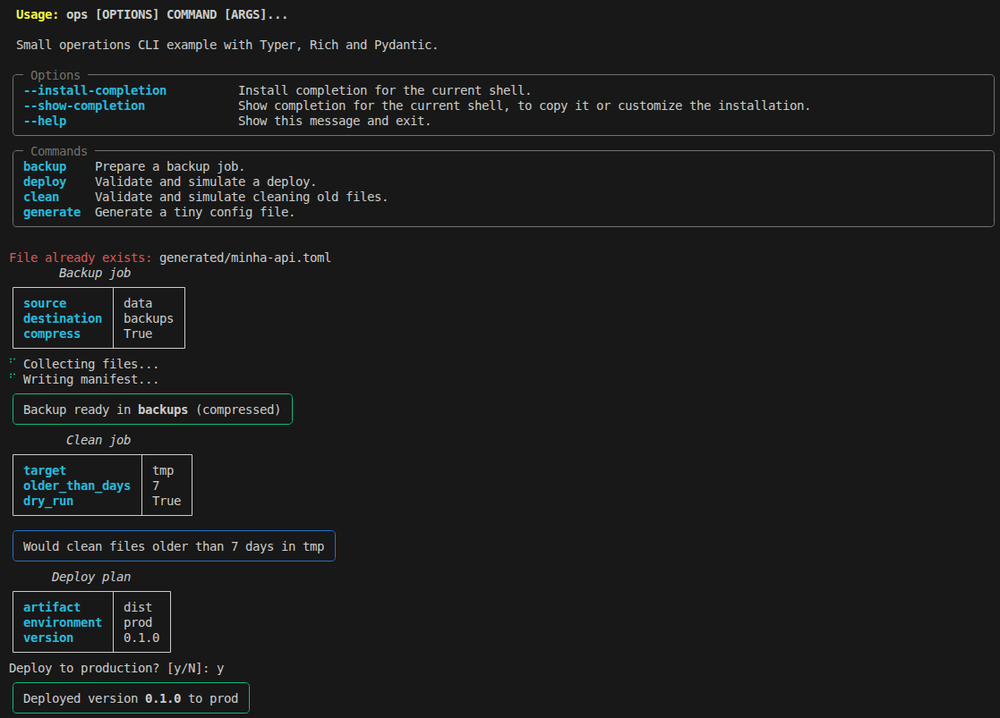

# Typer + Rich + Pydantic

A small Python CLI example with `backup`, `deploy`, `clean`, and `generate` commands.



## Install

```bash
cd typer-rich-pydantic
python -m venv .venv
source .venv/bin/activate
pip install -e .
```

## Usage

```bash
ops --help
ops generate --name minha-api --environment dev
ops backup ./data --destination ./backups
ops clean ./tmp --dry-run
ops deploy ./dist --environment prod
```

## How Each Library Is Used

- `Typer`: defines CLI commands, arguments, and options.
- `Rich`: renders tables, panels, status messages, and colored output.
- `Pydantic`: validates input data before each command runs.
